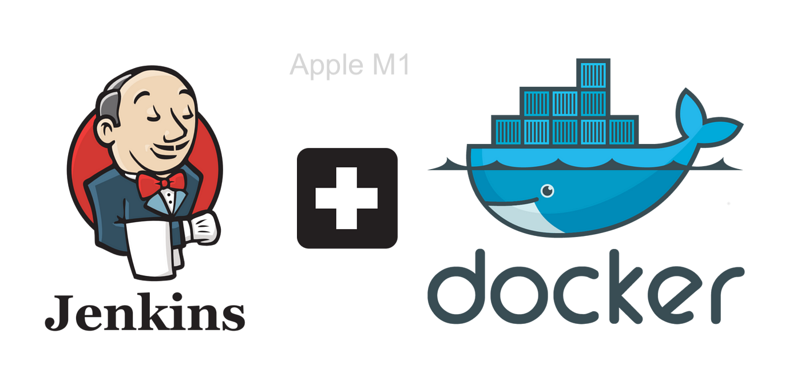

# Jenkins Container Uses Docker on a M1 Mac



### Start docker
Using [makefile](https://opensource.com/article/18/8/what-how-makefile)
```bash
make init
```
### Jenkins local url
>http://localhost:8000


### Get initial password
```bash
make show-initial-password
```

### Install docker in server
>with ansible in provisioning folder
>cd provisioning
> setup ssh host hosts.yml.dist > hosts.yml
Install docker | certbot in server
```bash
make server
```

### Setup ssh key
```bash 
make authorize
```

### Deploy
>change 152.67.79.19 > your server address
```bash
HOST=152.67.79.19 PORT=22 make deploy
```

### Remove docker images
```shell
ssh deploy@152.67.70.96 -t "docker system prune -af"
```

### Docker Jenkins Bcode URL
>https://Jenkins.bcode.kg


